# BWF World Tour Match Outcome Analysis

## SRN: 7826201968

## Executive Summary

**Research question:** Does the volume and intensity of matches played in the weeks before a tournament affect a player's probability of winning their next match on the BWF World Tour?

**Dataset:** Men's singles matches from the BWF World Tour, 2018–2021.

**Approach:**
The raw match data was cleaned, enriched with match-intensity features (game closeness, momentum swings, lead changes), reshaped into a player-centric cross-sectional dataset, and supplemented with rolling pre-match workload indicators derived from each player's prior match history. Two logistic regression models were then trained to predict the binary outcome of winning or losing a match. The first model was Standard Logistic Regression Model the second attempted to iterate on the first by using a Balanced Logistic Regression.

**Key findings:**

| Finding | Detail |
|---|---|
| Match load does not strongly predict outcomes | Pre-match workload features have correlations with `winner` below 0.07 |
| More recent matches slightly favour winning | `matches_last_3_weeks` was the strongest workload predictor (r = +0.07) |
| Consecutive load is a weak negative signal | `consecutive_matches_played` had a negative model coefficient, suggesting that sustained back-to-back matches may marginally reduce win probability |
| Baseline logistic regression accuracy | 55.8% (ROC AUC 0.521) |
| Balanced logistic regression accuracy | 52.6% (ROC AUC 0.521) — higher recall for winners at the cost of overall accuracy |

**Conclusion:** Recent match load, on its own, has very limited predictive power over match outcomes but do show a small amount of credence to the idea of tournament fatigue, whereas the the matches_last_3_weeks may be closer to the theory of momentum recent player performance effecting win rate. The ROC AUC sitting close to 0.5 for both models indicates the features carry little discriminatory signal. This is a meaningful finding in itself: player fatigue from recent match volume does not clearly translate into poorer results in the next match on the BWF World Tour. Future work should incorporate opponent quality, player ranking, and rest days to improve predictive performance.


## Literature Review
Advanced machine learning and data analytics have been extensively applied to sports science, particularly for predicting match outcomes. Research in this domain falls into three main categories: in-play analysis, historical analysis, and external factors such as training load.

Key Studies:

Wang, D. et al. (2025) identifies metrics with varying impacts on model performance, establishing a clear framework for tiering features by relevance. While focused on momentum data, this hierarchical approach to feature importance provides valuable guidance for feature selection.

Qiu, M. et al. (2024) demonstrates through descriptive statistics that winning teams exhibit higher average momentum events and overall momentum compared to losing teams, establishing a positive correlation between momentum metrics and match outcomes.

Midi, H. and Ariffin, S.B. (2012) outlines key limitations of event-based logistic regression models and proposes building more robust models through improved outlier detection—particularly valuable for models utilizing historical data.

Lotfi, S. and Rebbouj, M. (2021) provides comprehensive analysis of traditional mathematical models' limitations, advocating for diverse methodologies including unsupervised neural networks and incorporating external data sources such as coaching information.

Liu, J., Zhu, X. and Wang, S. (2024) explores how neural network architectures like Particle Swarm Optimization with Backpropagation (PSO-BP) address current methodological limitations.

These studies suggest conservative expectations when employing traditional logistic regression approaches. They emphasize the critical importance of robust feature engineering while avoiding noise and collinearity issues that can compromise model performance.


## Dataset

**Source:** [Kaggle Dataset](https://www.kaggle.com/datasets/sanderp/badminton-bwf-world-tour)

**Time Frame:** 2018–2021

**Raw size:** 3,761 matches

**Processed size:** 7,522 player-level rows (one row per player per match)

The raw dataset (`data/ms.csv`) contains match-level records including player names, nationalities, tournament names, tournament rounds, game-by-game scores, and match outcomes.

---

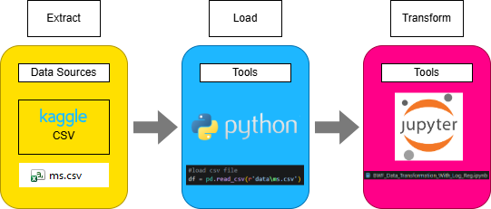

## Methodology

The analysis follows a structured pipeline across 12 sections in the notebook:

### 1. Setup
Imports all required libraries for data processing, feature engineering, visualisation, and modelling.
```
# libraries used for data transformation
import ast
import pandas as pd
import numpy as np
from typing import List, Tuple, Dict
from collections import defaultdict

# libraries used for data visualization
import matplotlib.pyplot as plt
import seaborn as sns

# libraries used for machine learning
from sklearn.compose import ColumnTransformer
from sklearn.impute import SimpleImputer
from sklearn.linear_model import LogisticRegression
from sklearn.metrics import accuracy_score, classification_report, confusion_matrix, roc_auc_score
from sklearn.model_selection import train_test_split
from sklearn.pipeline import Pipeline
from sklearn.preprocessing import StandardScaler
```

### 2. Load Raw Match Data
Reads the source CSV file containing match-level information, player identifiers, scores, and round data.
```#load csv file
df = pd.read_csv(r'data\ms.csv')
```

### 3. Clean and Transform Match Data

**Round ranking:** Tournament round names (e.g., `Round of 16`, `Semi final`, `Final`) are mapped to a consistent ordinal integer rank across six distinct tournament formats to allow cross-tournament comparison.

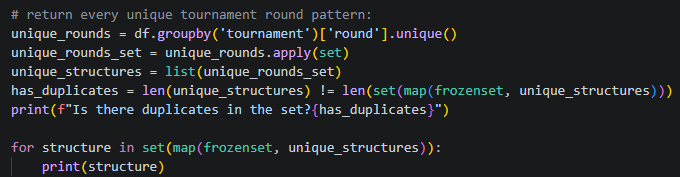

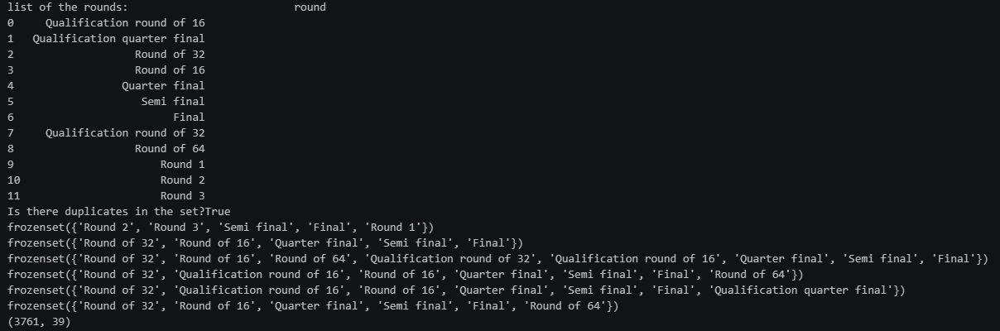

**Retired match resolution:** Matches where the outcome field is `0` (retirement/walkover) are resolved by tracing which player appeared in the next round of the same tournament and updating the winner and retired fields accordingly.

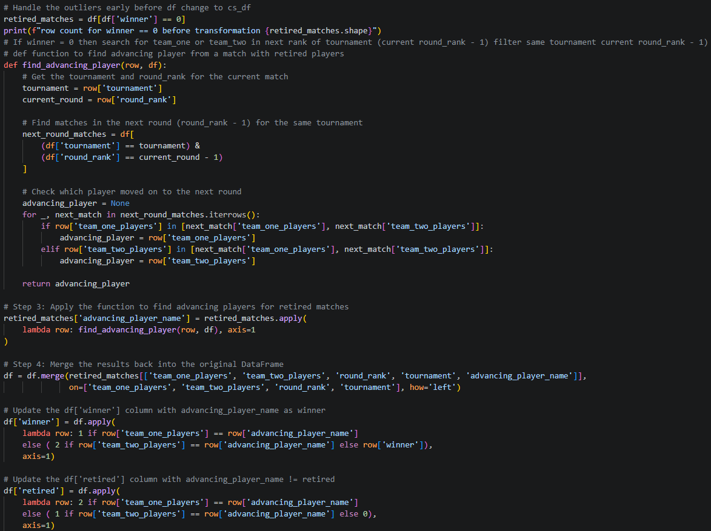

here is the two final columns used to link past matches

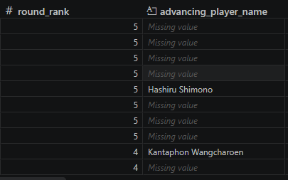

### 4. Feature Engineering — Iteration 1: Match Intensity Features
33 new features are derived from the point-by-point score progressions stored in each game's score column. For each game (1, 2, 3) and at the match aggregate level:

| Feature group | Variables created |
|---|---|
| Closeness | `closeness`, `closeness_ratio`, `avg_score_diff`, `std_score_diff`, `final_score_diff` |
| Momentum | `momentum_swings`, `lead_changes` |
| Lead extremes | `max_lead_team1`, `max_lead_team2` |
| Match-level aggregates | `match_avg_closeness`, `match_total_momentum_swings`, `match_total_lead_changes`, `match_avg_score_diff`, `match_close_games_count`, `match_max_momentum_swings` |

Many of these features are following example made in Wang, D. et al. (2025) and help to narrow down wat will actually be used in the final models

### 5. Reshape to a Player-Centric Modelling Table
The match-level table (one row per match) is converted to a cross-sectional table with one row per player per match. This assigns each player a binary `new_winner` target (1 = won, 0 = lost) and attaches all match-level features from their perspective. `new_winner` is then remapped to `winner`

**example of one of the variation that has to be made:**

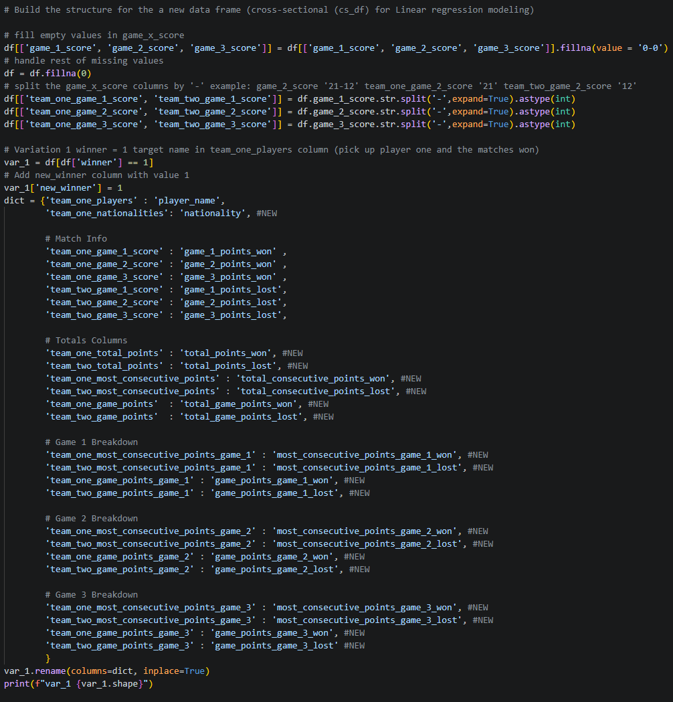

### 6. Remove Columns Not Needed for Modelling & remap winner
Identifier columns, raw score strings, game score fields, and intermediate derived columns are dropped to produce a clean modelling table.

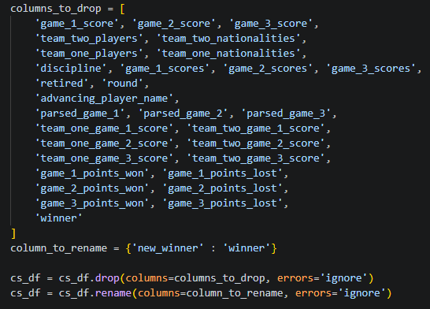

### 7. Feature Engineering — Iteration 2: Pre-Match Workload Features
Rolling loopback features are computed for each player row using only matches that occurred **before** the current match date (no data leakage). A 21-day lookback window is used.

| Feature | Description |
|---|---|
| `matches_last_3_weeks` | Number of matches played in the 21 days before this match |
| `consecutive_matches_played` | Length of the current run of back-to-back matches (max gap 3 days) |
| `avg_total_points_recent` | Average total points played per match in the lookback window |
| `avg_closeness_recent` | Average match closeness score in the lookback window |
| `avg_nb_sets_recent` | Average number of sets played per match in the lookback window |

### 8. Screen Candidate Predictors
A full correlation heatmap is produced to show the association of every numeric column with the binary `winner` target, guiding feature selection.

**First Heatmap**

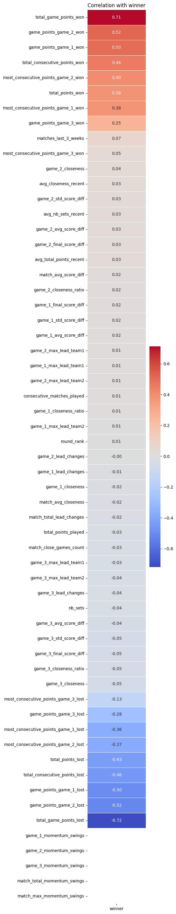

This highlighted the self selecting features that would make the model over fit so the features where adjusted:

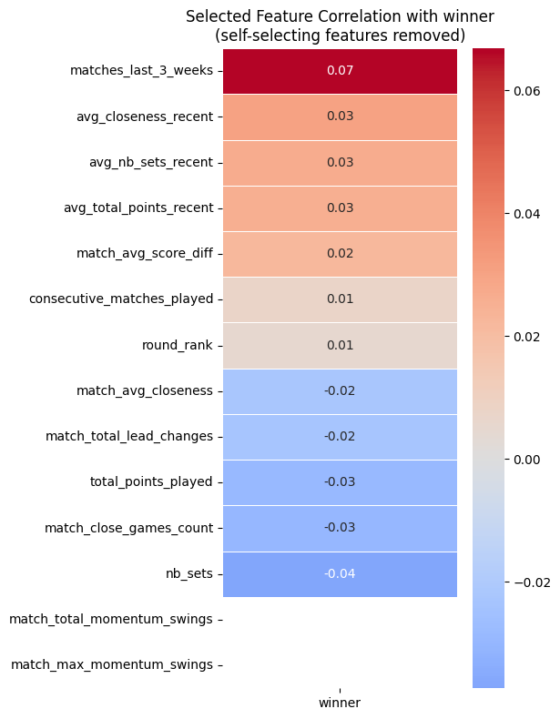

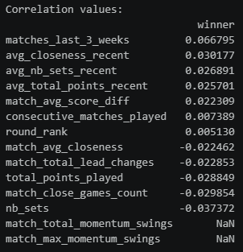

### 9. Modelling — Iteration 1: Baseline Logistic Regression
A scikit-learn `Pipeline` with median imputation, standard scaling, and logistic regression is fitted on the six pre-match features. The model is evaluated on a held-out 20% test split with stratification.

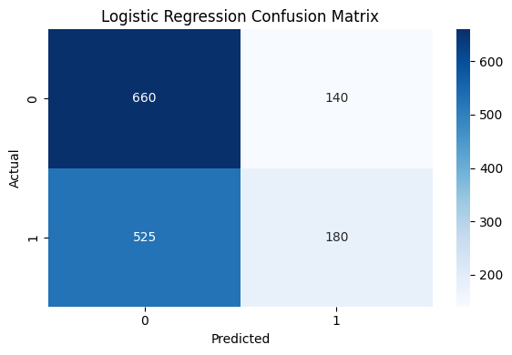
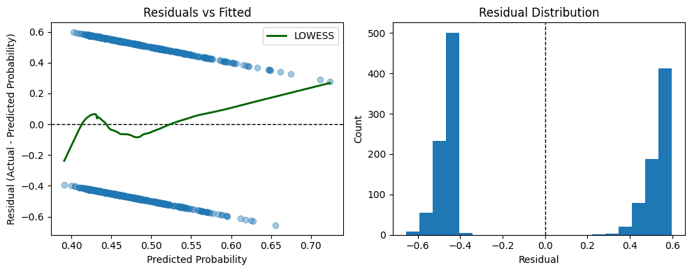
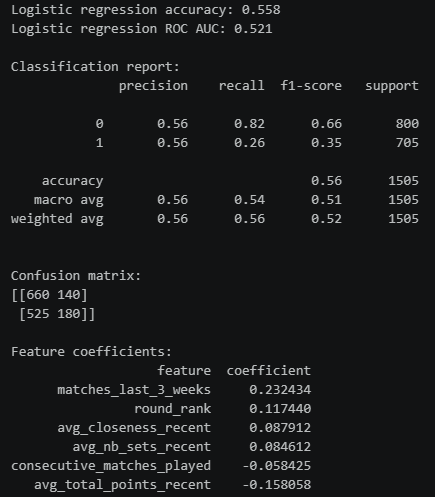

### 10. Modelling — Iteration 2: Balanced Logistic Regression
The same pipeline is repeated with `class_weight='balanced'` to correct for the slight class imbalance and test whether recall for winners improves.

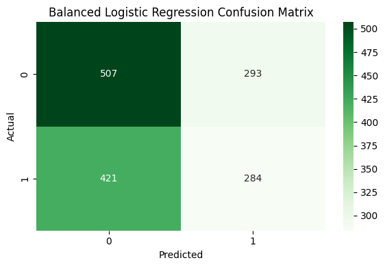
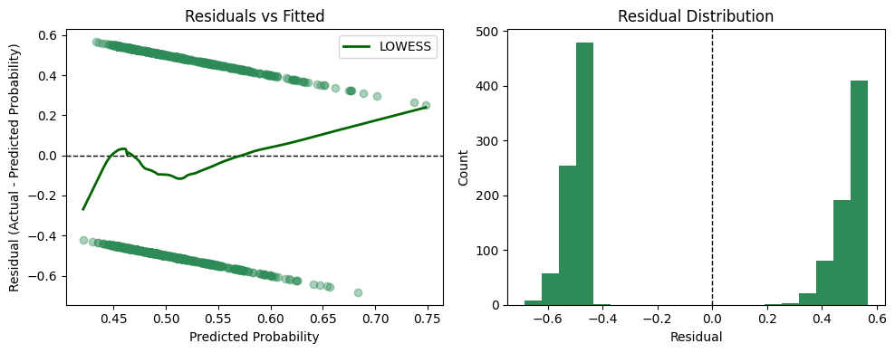
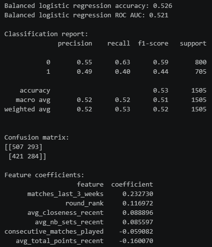
---

## Results

### Correlation with match outcome

| Feature | Pearson r with `winner` |
|---|---|
| `matches_last_3_weeks` | +0.07 |
| `consecutive_matches_played` | +0.04 |
| `avg_closeness_recent` | +0.03 |
| `avg_nb_sets_recent` | +0.03 |
| `avg_total_points_recent` | +0.03 |

All pre-match workload features show very weak correlations with outcome.

### Model performance

| Model | Accuracy | ROC AUC | Recall (winners) |
|---|---|---|---|
| Baseline logistic regression | 55.8% | 0.521 | 26% |
| Balanced logistic regression | 52.6% | 0.521 | 40% |

The balanced model improves recall for winners by 14 percentage points at the cost of 3.2 percentage points of overall accuracy. The ROC AUC is identical (0.521, near chance), confirming the improvement is a decision-threshold shift rather than a gain in signal.

### Residuals

Both models produce the expected bimodal residual distribution for a near-balanced binary target. No systematic directional bias is detected in either model — the issue is feature weakness rather than model misspecification.

---

## Conclusion

Recent match load, on its own, has very limited predictive power over match outcomes on the BWF World Tour. A ROC AUC of 0.521 for both models indicates the selected pre-match features carry almost no discriminatory information beyond chance.

This is a substantive finding: elite players appear able to maintain consistent performance regardless of recent match volume, or recovery and scheduling practices at the World Tour level effectively mitigate fatigue effects.

### Suggested next steps

1. Add player ranking or seeding as a predictor — likely to explain far more variance than load alone.
2. Include days since last match as a direct measure of rest.
3. Test non-linear models (Random Forest, XGBoost) to capture interaction effects between load variables.
4. Investigate sub-groups such as younger versus more experienced players who may respond differently to match load.


### References

Liu, J., Zhu, X. and Wang, S. (2024) (PDF) Quantitative Analysis and prediction methods for sports competition results, Quantitative Analysis and Prediction Methods for Sports Competition Results. Available at: https://www.researchgate.net/publication/381535258_Quantitative_Analysis_and_Prediction_Methods_for_Sports_Competition_Results (Accessed: 01 April 2026). 

Lotfi, S. and Rebbouj, M. (2021) (PDF) machine learning for sport results prediction using algorithms, https://www.researchgate.net/. Available at: https://www.researchgate.net/publication/353665925_Machine_Learning_for_sport_results_prediction_using_algorithms (Accessed: 04 April 2026). 

Midi, H. and Ariffin, S.B. (2012) (PDF) the performance of classical and robust logistic regression estimators in the presence of outliers, The performance of classical and robust logistic regression estimators in the presence of outliers. Available at: https://www.researchgate.net/publication/287477313_The_performance_of_classical_and_robust_logistic_regression_estimators_in_the_presence_of_outliers (Accessed: 04 April 2026). 

Qiu, M. et al. (2024) The influence of ‘Momentum’ on the game outcome while controlling for game types in basketball, Frontiers in psychology. Available at: https://pmc.ncbi.nlm.nih.gov/articles/PMC11211628/ (Accessed: 03 April 2026). 

Wang, D. et al. (2025) Quantifying momentum and influencing factors of tennis players using the XGBOOST model, Scientific reports. Available at: https://pmc.ncbi.nlm.nih.gov/articles/PMC12089293/ (Accessed: 02 April 2026). 

### Appendix

Appendix 1: Structure of the evaluation system

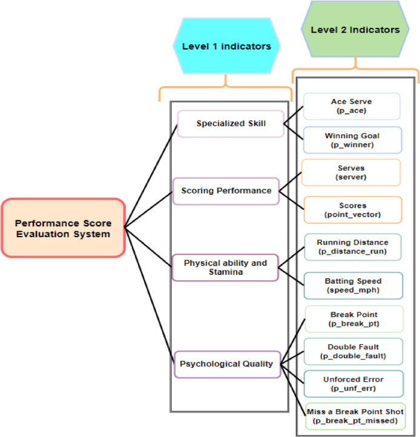

Wang, D. et al. (2025) Quantifying momentum and influencing factors of tennis players using the XGBOOST model, Scientific reports. Available at: https://pmc.ncbi.nlm.nih.gov/articles/PMC12089293/ (Accessed: 02 April 2026).

Appendix 2: Momentum effecting outcome of winning

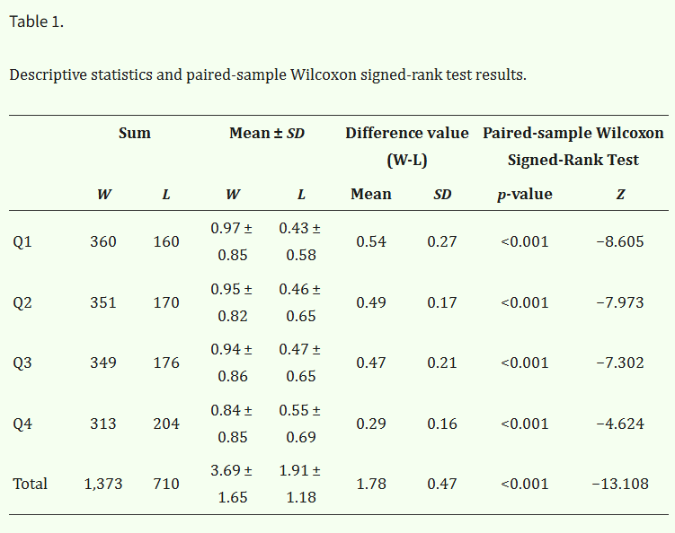

Qiu, M. et al. (2024) The influence of ‘Momentum’ on the game outcome while controlling for game types in basketball, Frontiers in psychology. Available at: https://pmc.ncbi.nlm.nih.gov/articles/PMC11211628/ (Accessed: 03 April 2026). 